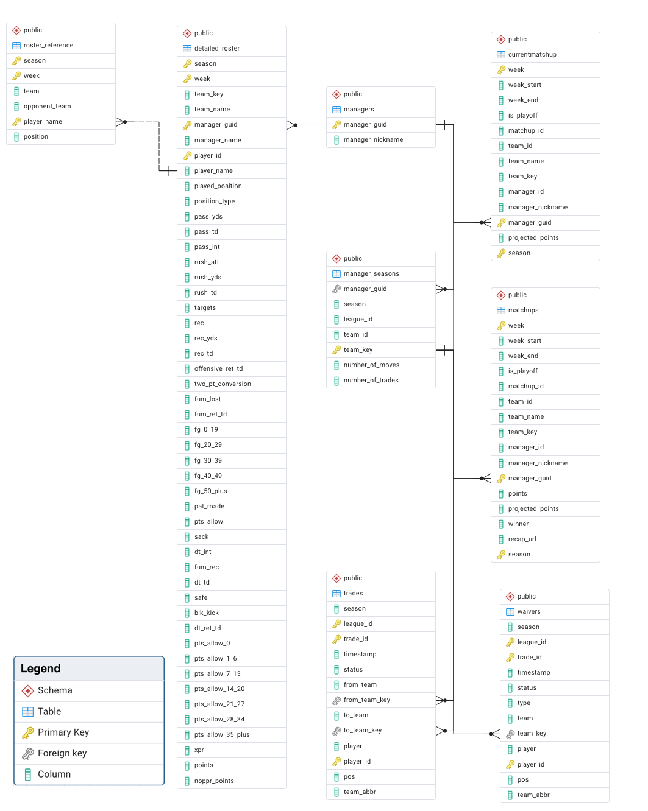

# Fantasy Football Database

A comprehensive database system for tracking and analyzing fantasy football league data, built to record league activity and provide insights for draft strategy and weekly lineup decisions.

## Overview

This project constructs a relational database for a 10-manager fantasy football league. Each manager owns a team of 14 active players and competes head-to-head weekly by selecting their optimal lineup (1 QB, 2 RB, 3 WR, 1 TE, 1 FLEX, 1 K, 1 DEF). After 14 weeks of regular season play, the top teams compete in a playoff tournament culminating in a championship in week 17.

## Features

- **League Management**: Track managers, seasons, and weekly matchups
- **Player Tracking**: Monitor weekly rosters and player performance
- **Transaction History**: Record trades and waiver wire pickups
- **Performance Analytics**: Calculate win/loss records and head-to-head statistics
- **NFL Integration**: Link fantasy players to real NFL teams and opponents

## Data Sources

### Yahoo Fantasy Sports API
- **Primary data source** for all league activity
- Provides comprehensive tracking of league history
- Access via [Yahoo Fantasy Sports API](https://developer.yahoo.com/fantasysports/guide/)
- Returns data in JSON format, parsed and transformed into tabular SQL data

### nflreadpy Library
- **Reference data source** for NFL information
- Tracks player-team relationships by season
- Provides opponent scheduling data
- Documentation: [nflreadpy.nflverse.com](https://nflreadpy.nflverse.com/)
- Essential for lineup decisions based on matchup analysis

## Database Schema

The database is organized into three primary schemas:

### `manager_info`
- **managers**: League participants
- **seasons**: Season-level data
- **matchups**: Weekly head-to-head competitions

### `player_info`
- **roster_reference**: Master list of all NFL players
- **detailed_roster**: Weekly manager rosters with player stats
- Links players to teams and opponents

### `transactions`
- **trades**: Inter-manager player trades
- **waivers**: Waiver wire pickups and drops

## Entity-Relationship Diagram

The ERD shows the complete database structure with all entities, attributes, and relationships. Key relationships include:
- Managers participate in multiple seasons
- Managers compete in weekly matchups
- Rosters link managers to players for specific weeks
- Transactions track player movement between teams

## Goals

### Primary Goal
Record and preserve the complete history of league activity with friends, creating a permanent record of all seasons, matchups, and transactions.

### Secondary Goal
Build a machine learning model trained on league-specific data to provide insights for:
- Draft strategy optimization
- Weekly lineup recommendations
- Player performance predictions based on matchups

## Future Development

- Neural network integration for predictive analytics
- Advanced statistical analysis of manager tendencies
- Automated weekly lineup recommendations
- Historical trend analysis and visualization